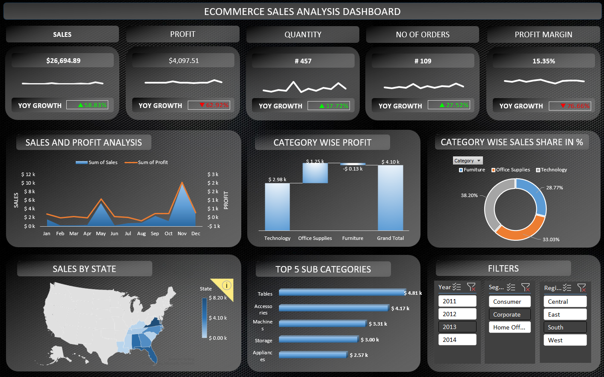

# Ecommerce Sales Analysis Dashboard

## 📌 Project Overview
This repository contains a comprehensive **Ecommerce Sales Analysis Dashboard** built to analyze sales performance, profitability, and customer behavior. The analysis covers historical transaction data from **2011 to 2014** (spanning 9,994 transaction records) to track growth trends, identify high-performing product segments, and discover regional sales opportunities.

### 📊 Dashboard Preview

---

## 🚀 Key Features & Views Included
The dashboard utilizes dedicated data cuts and pivot tables to answer critical business questions:

1. **KPI & YoY Growth Tracker**: Tracks high-level metrics including *Total Sales, Total Profit, Item Quantity, Order Count*, and *Profit Margin* alongside Year-over-Year (YoY) performance changes.
2. **Monthly Sales & Profitability (Combo Chart)**: A dual-axis time-series visualization highlighting seasonal peaks and monthly correlations between sales volume and net profit.
3. **Profit Contribution Analysis (Waterfall Chart)**: Breaks down profit contributions by major categories (**Technology, Office Supplies, Furniture**) to pinpoint which sectors drive growth or drag margins.
4. **Category Market Share (Pie Chart)**: Visualizes the exact proportions of total sales generated across different product categories.
5. **Geographical Performance (Map Chart)**: Maps sales distributions across different U.S. states (e.g., Virginia, Florida, Georgia, Alabama) to identify regional market share.
6. **Top 5 Product Sub-Categories**: Highlights the top-performing product lines by sales volume (e.g., Tables, Accessories, Machines, Storage, Appliances).

---

## 📁 Dataset Details
* **Source File:** `Ecommerce Sales Analysis.xlsx`
* **Dataset Size:** 9,994 rows, 22 columns
* **Key Attributes Analyzed:**
  * **Order Metrics:** Order ID, Order Date, Ship Date, Ship Mode, Quantity.
  * **Customer Profiles:** Customer ID, Name, Segment (Consumer, Corporate, Home Office).
  * **Geography:** Country, City, State, Region.
  * **Product Breakdown:** Product ID, Category, Sub-Category, Product Name.
  * **Financial Metrics:** Sales, Discount, Profit, Profit Margin.

---

## 📈 Key Insights from the Data
* **Profitability Drivers:** The **Technology** category acts as the primary driver of net profit, whereas categories like **Furniture** experience tighter margins, experiencing heavy down-pulls from structural discount rates.
* **Seasonality Trends:** Sales volumes exhibit sharp cyclical peaks during the final months of the year (**November and December**), indicating heavy holiday-season dependencies.
* **Top Sub-Categories:** Items such as *Tables, Accessories, and Machines* lead overall sales revenue volume.

---

## 🛠️ Tools Used
* **Microsoft Excel**: Pivot Tables, Pivot Charts, DAX Measures, Conditional Formatting, and Advanced Formula Modeling.
* **Markdown**: For compiling repository documentation.

---

## ⚙️ How to View the Project
1. Clone this repository to your local machine.
2. Navigate to the `data/` folder.
3. Open `Ecommerce Sales Analysis.xlsx` in Microsoft Excel (2016 or newer recommended for full interactive chart features).
